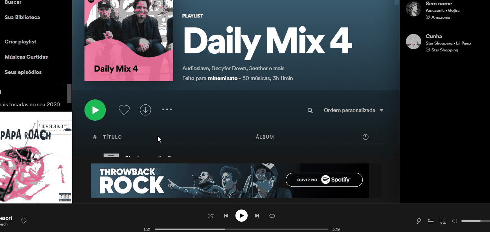
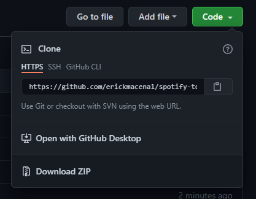
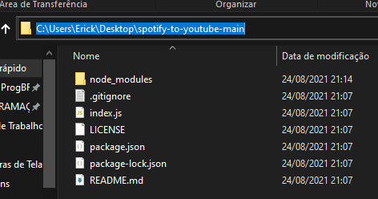
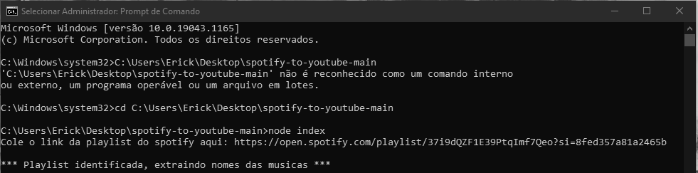

# 🤖 Spotify para Youtube 🤖

#### Um bot que transforma uma playlist do Spotify em listas de vídeos do Youtube.

### Porquê eu criei o bot

Primeiramente, porquê pareceu legal :). Segundamente, porquê senti necessidade de treinar Node.JS, e nada melhor do que fazer um programa útil para você. No meu caso, utilizo-o para colocar minhas playlists do spotify em salas do discord enquanto jogo com amigos 🙂.

### Tecnologias utilizadas

- NodeJS 💚
- Javascript 💛
- Puppeteer 🤖

### Como testar

1° Caso não tenha o Node.JS em sua máquina, instale-o aqui [nodejs.org](https://nodejs.org)

2° Baixe o projeto clicando no botão verde com uma seta para baixo em Download Zip

3° Extraia o arquivo baixado no local de sua preferência e copie o endereço do local onde você o extraiu

5° Aperte a tecla do Windows, digite "prompt" e execute o prompt de comando em modo administrador

6° Digite "CD" dê um espaço, cole o endereço que havia copiado e aperte enter

7° Digite "npm i", aperte enter e espere o download dos pacotes terminar

8° Digite "npm start" e aperte enter

9° Após isto basta colar o link da sua playlist e deixar a <del>mágica</del> programação acontecer 🙂

## Contatos

#### - Meu Linkedin 👨‍💻 [linkedin.com/in/erickmacena](https://linkedin.com/in/erickmacena)
#### - Meu Email 📧 erickmacena2@gmail.com